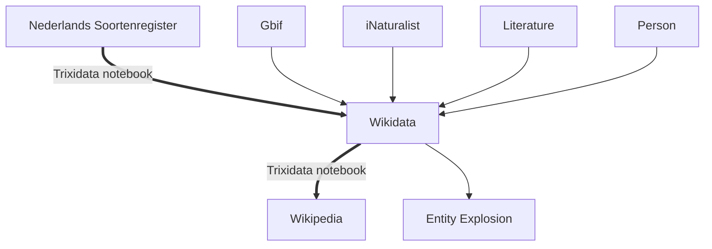
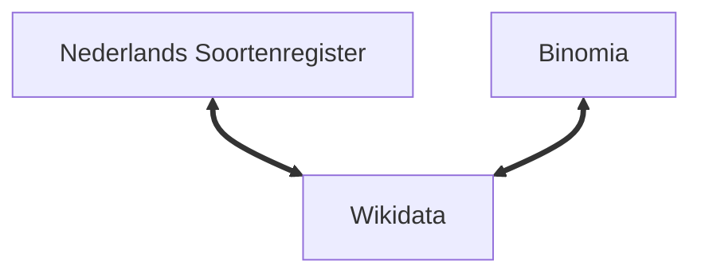
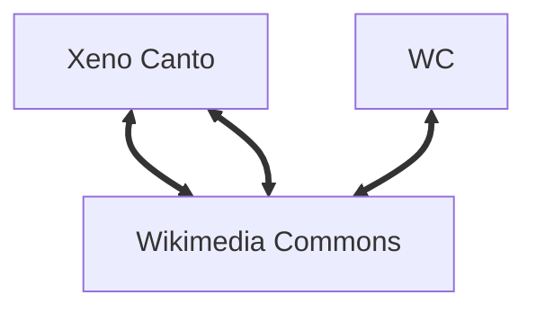

# Wikidata @ arise_hack2022

## Linking Nederlandse Soortenregister in Wikidata

## Linking collections with collectors from the carribean through Wikidata

## What do green iguana eet

## Birdsounds in Wikidata

