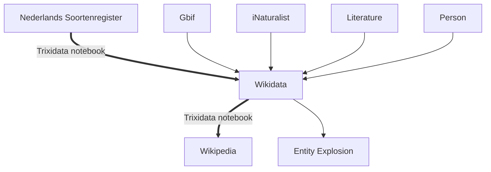

# Wikidata @ arise_hack2022

We participated in [the ARISE hackathon](https://www.arise-biodiversity.nl/hackathon). We worked on aligning the [Nederlandse Soorten Register](https://www.nederlandsesoorten.nl/) with Wikidata, with the eventual goal to link it to the linked data cloud. This allows reuse in a wide variety of use case, of which we explored some in this hackathon. 

## Linking Nederlandse Soortenregister in Wikidata

The result is a jupyter notebook which we called Trixidata Notebook. This notebook takes csv export from a (sub)list of the Dutch Species Registry to align with Wikidata. 
Once aligned we are able to identify:
1. missing identifiers wikidata from GBIF, iNatrualist of even the Nederlandse Soortenregister itself;
2. missing Wikipedia articles
3. species from that list that are not yet covered in Wikidata
4. identify potential references
5. identify images that can be reused in various use cases.

We started the following list of Wikipedia articles based on the results extracted with the Notebook.
1. [Aedes_atropalpus](https://en.wikipedia.org/wiki/Aedes_atropalpus)
2. [Verbena_incompta](https://nl.wikipedia.org/wiki/Verbena_incompta)

## Suplimentary reuse examples 

### Linking collections with collectors from the carribean through Wikidata
Building on earlier work done in previous hackathon (e.g. [Alien CSI Hackathon](https://github.com/alien-csi/alien-csi-hackathon), we started linking collectors, collections and their species using Wikidata. Starting from a [spreadsheet](https://docs.google.com/spreadsheets/d/1lcElRFJHOfcZTsgzjbx1jEgpEAAgcn4GJ0MnvU80TM0/edit?usp=sharing). links are made with Wikidata. Once aligned we can link them to other parts in Wikidata. 

### What do green iguana eet
Using the same workflow as in the trixidata notebook, it was possible to identify missing Wikipedia articles from a set of plantspecies that are eaten by iguanas. 55 prospective new Wikipedia articles have been identified for future writing starting for a slightly different input set then the Nederlnadse Soorten Register

